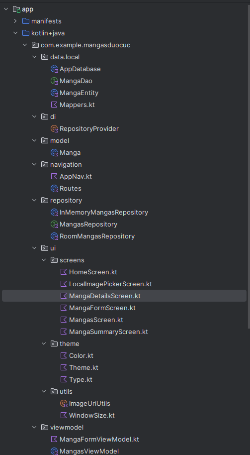

Sekai no Manga (Android) — DSY1105

Aplicación Android para gestionar una colección de mangas: crear, listar, ver detalle y eliminar. Construida con Jetpack Compose, MVVM, Room, Coroutines/Flow y una DI simple mediante RepositoryProvider.

Funcionalidades

Listado de mangas con portada, título, autor y año.

Crear y editar (formulario simple).

Eliminar desde la lista (diálogo de confirmación) y snackbar de feedback.

Estado vacío con CTA para crear el primer manga.

UI en Material 3 con mejoras simples (chips autor/año, cards con borde y elevación).

Persistencia local con Room; la lista reacciona automáticamente a los cambios (Flow → StateFlow).

Stack Técnico

UI: Jetpack Compose (Material 3)

Arquitectura: MVVM + Repository

Persistencia: Room (SQLite)

Asincronía: Kotlin Coroutines + Flow/StateFlow

DI simple: RepositoryProvider

Estructura del proyecto image

🛠️ Requisitos

Android Studio Jellyfish o superior

JDK 17 (AGP 8.x lo requiere)

Android SDK (API 33+ recomendado, vale 29+)

Cómo clonar, sincronizar y ejecutar

Clonar

git clone https://github.com//DSY1105-SekaiNoManga.git cd DSY1105-SekaiNoManga/SekaiNoMangaApp

Abrir en Android Studio

File → Open… y selecciona la carpeta SekaiNoMangaApp/.

Confirma Trust Project.

Configurar Gradle

File → Settings → Build, Execution, Deployment → Gradle

Use Gradle from: Gradle Wrapper

Gradle JDK: 17

Instalar SDK (si falta)

Tools → SDK Manager → instala al menos una plataforma (Android 14/13).

Initial Sync y Build

File → Sync Project with Gradle Files

Build → Rebuild Project

Ejecutar

Crea un emulador desde Device Manager o conecta tu teléfono con Depuración USB.

Run ▶ app.

Arquitectura (MVVM + Repository) UI (Compose Screens) ⤷ ViewModel (StateFlow, orquestación y validación) ⤷ Repository (RoomMangasRepository / InMemoryMangasRepository) ⤷ Room (MangaDao, AppDatabase, MangaEntity)

UI: MangasScreen consume vm.mangas: StateFlow<List> y dispara acciones (crear, navegar, eliminar).

ViewModel: expone flujos, operaciones getMangaById, updateManga, addManga, deleteManga(id).

Repository: traduce String id ⇄ Long id y delega en MangaDao.

Room: @Dao con observeAll(), getById, insert, update, @Query("DELETE FROM mangas WHERE id = :id").

Uso de la app Agregar un manga

En la lista, pulsa “Crear primer manga” (si está vacía) o navega al Form.

Completa título, autor, año y opcionalmente portada (URI).

Guardar. La lista se actualizará automáticamente.

Ver detalle

Tocar un ítem de la lista → MangaDetailsScreen.

Eliminar un manga

Desde la lista (MangasScreen.kt): botón 🗑️ → confirmación → snackbar “Manga eliminado”.

(Opcional) Desde detalle: botón “Eliminar” con confirmación y popBackStack().

La UI no conoce Room. Solo llama vm.deleteManga(id). El Flow del repo emite la nueva lista; StateFlow del VM actualiza la pantalla sin lógica extra.

Comprobar que el borrado funciona (Database Inspector)

Con la app corriendo, abre App Inspection → Database Inspector.

Selecciona tu proceso → abre la BD → tabla mangas.

Elimina un ítem en la UI y pulsa Refresh: la fila debe desaparecer.